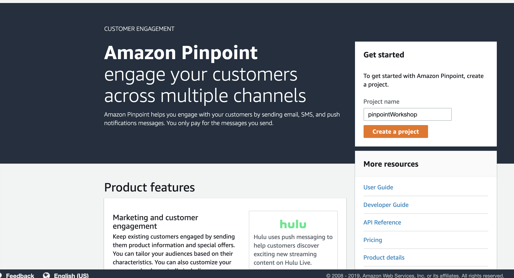
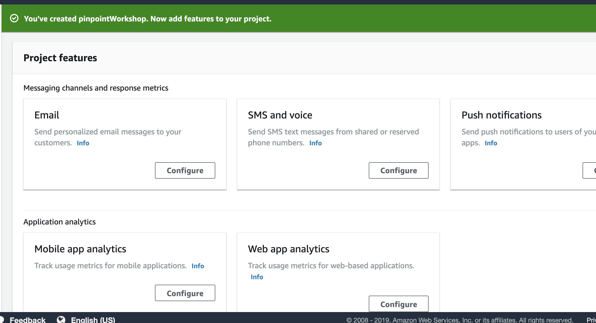
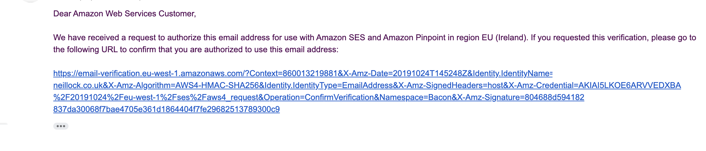
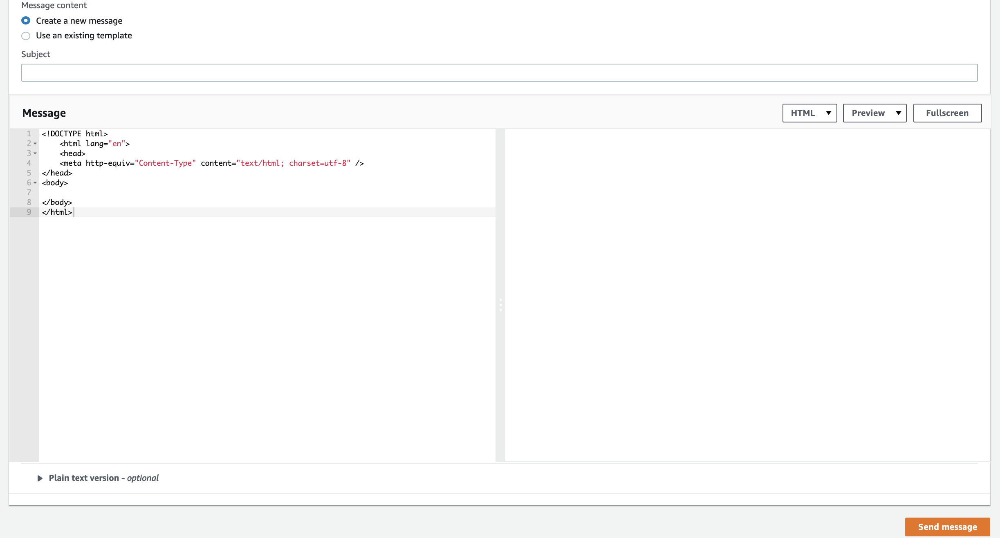

# pinpoint-workshop

## to do:
- [ ] fix region in urls
- [ ] sandbox info
- [ ] should we educate on endpoint limits


This workshop has two labs in it. The first lab covers creating a campaign and Journey within Amazon Pinpoint, whilst the second part covers embedding the Analytics API into your application to understand user behaviours and create dynamic segments. 

The second lab requires you to have completed lab 1.


## Step 1: Create Pinpoint Project

**This workshop has been tested in {{INSERT REGION HERE}}**

### Initial Configuration

1. First head to Amazon Pinpoint in the [AWS Console](https://us-west-2.console.aws.amazon.com/pinpoint/home?region=us-west-2#/apps). Enter a project name of `pinpointWorkshop` and click on the 'Create a project' button  
2. For this workshop we will cover Email and SMS And voice, so first of all click on `Configure` underneath  Email. 
3. We have to validate that you own the email address to stop people being able to send emails with incorrect emails adresses. This lab requires you to validate your email address (and we will do more later on). Enter your email address and click verify. You will be instantly emailed a link which you need to click on to verify you own the account.
4. Click Save.
5. If you want to be able to send emails (while in sandbox mode [insert url]) to other accounts you will have to add these as well. You can do this by going to `Settings -> Email -> Identity Details -> Edit` and then adding and verifying a new email address.
6. There are also limits you may want to enable...
7. You are also able to send SNS via Pinpoint but as with Emails, you need to enable this first. To do this go to  `Settings -> SMS and Voice -> Edit` and enable the SMS channel for this project.

You Pinpoint project is now ready to send messages.

## Step 2: Sending some test messages


In the menu bar on the left hand side click on `Test Messaging`.

### Test Email

1. Click on `Email`.
2. The sender email address should already be configured following the setup in Lab 1.
3. Enter the same email address in the destination as the sender (as we know this address is verified)
4. Create a simple message and enter a subject line then click `Send message` - now check your inbox as you should have mail!

### Test SMS

1. Click on `SMS`
2. Enter your Phone numbers
3. Fill in a message body
4. Click send message.


## Creating a segment

* Click on segments
Upload Segment (sample segment.csv replace email and mobile numbers)


## Create a campaign

* create a campagin
-[ ] issue with send on timezone.

* Name the campaign
* Standard campaign
* chose either sms or email (assuming sms number uploaded in segment)
* Chose segment you have uploaded 
* build message
* click next
* send immediately but note how you could send a weekly (scheduled email)

- [ ] Generate sample html templates

## Journeys

* create templates - only email supported at the moment
* 
* chose entry trigger
- [x] can we embed an SMS No. It’ll probably be next year. 


- [x] what does condition type "segment" mean? It means that anyone who’s a member of the selected segment will go down that path. I think the idea is that you could have one master segment that enters the journey, and a bunch of sub-segments that complete different paths within the journey. 
 --[ ]
- [x] mv split - does it priorities based on higher alph eg if branch a is open and branch b is click will the user get branch a? yes


#
```js
npx create-react-app myapp
cd myapp
amplify init
amplify add hosting
amplify publish

amplify add auth 
    -> default
    -> email 
amplify publish

yarn add aws-amplify-react  aws-amplify
```

modify source code to add auth ->index.js

```
amplify add analytics
```